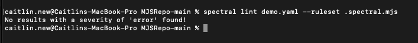

Callsign's mobile SDK

Android

Mobile SDK guide for Android

iOS

Mobile SDK guide for iOS

The Callsign mobile SDK delivers all the features of the Callsign mobile platform to compatible <b>Android</b> or <b>iOS</b> smartphone applications, enabling a secure and seamless user experience. All technical sophistication of the platform is embedded in the SDK, which has been designed as an easy-to-use developer interface.

* Callsign’s mobile SDK is embedded into an existing mobile app that is owned by the client
* The SDK can be configured to perform activities that otherwise take the client an incredible amount of time to develop, e.g., generate OTP’s and manage requests
* At Callsign, the mobile SDK can be deployed to launch a large variety of our intelligence models as well as perform other actions such as authentication orchestration and consent gathering

Mobile SDK can perform a number of functions, namely:

* Registration
* Reactivation
* Behavioral authentication
* Device info collection
* Native keystrokes collection
* Multi-device support
* Dynamic fraud intervention
* Push notifications
* Cross-channel wait handling
* Support of external authenticators
* SMS OTP verification
* HOTP passcodes
* Custom UI with Callsign PIN
* User-managed authenticators

On mobile authenticators, if there is challenge data to sign, mobile will perform transaction signing.

 
 

### Get in touch

We're keen to hear about your experience and how we can improve. 

<!--
type: tab
title: Feedback on documentation?
-->
Let us know your thoughts about our documentation and what you'd like to see added by leaving us [feedback](mailto:support@callsign.com).

<!--
type: tab
title: Have a question?
-->

- If you’d like to learn more about Callsign products, [get in touch](https://www.callsign.com/contact)
- If you’re an existing customer, then please reach out to your client account manager

<!--
type: tab
title: Want to keep up to date?
-->
[
](https://www.callsign.com) 
 | 
 
 | 
 
 | 

---------|----------|--------- |---------

<!-- type: tab-end -->

