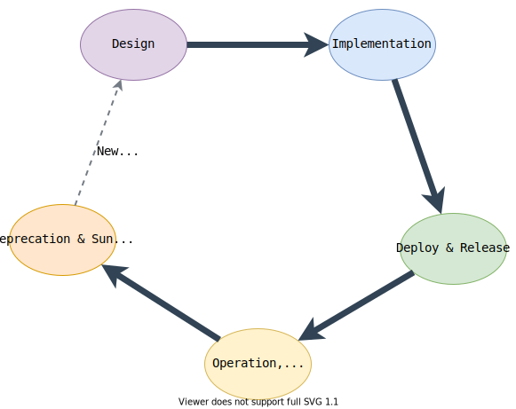

blah blah blah blah blah stupid github workflow sdfsd




```json stupid thing
{
"ref": "reference/idk.yaml#/components/schemas/User"
}
```

```json jsonSchema
{
  "ref"
}
```

```html
// Accepting Valid Telephone Input test
<salla-tel-input onclick="telInput.isValid()" country-code"sa" country-key="+966" mobile="5555555">
  // Getting Inputted validateRequest
  <salla-button fill="outline" color="primary" onclick="getValues()">
    GetValues
  </salla-button>
```

idk.yaml/components/schemas/User
